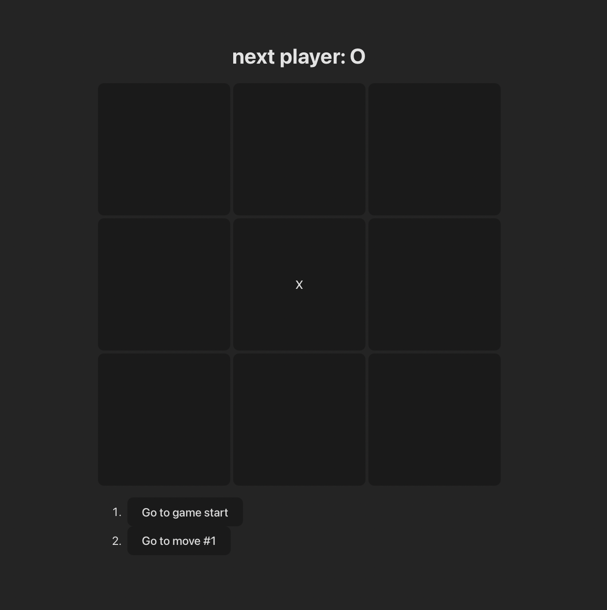

# Tic-Tac-Toe — React + TypeScript + Vite

A lightweight Tic-Tac-Toe built with React, TypeScript, and Vite.  
Includes move history (time travel) and automatic winner detection.

## Features
- 3×3 board with alternating X/O turns
- Winner detection (rows, columns, diagonals)
- Move history with jump-to-move buttons
- Clean TypeScript types and React components
- Fast dev experience via Vite + HMR

## Requirements
- Node.js 18+
- npm, pnpm, or yarn

## Getting Started

Install and run:

    git clone <your-repo-url>
    cd <your-project-directory>
    npm install
    npm run dev

Vite serves the app at http://localhost:5173 by default.

### Build and Preview

    npm run build
    npm run preview

## Project Structure (simplified)

    src/
      main.tsx            # App bootstrap
      index.css           # Styles (.game, .game-board, .board-grid, .square, .status)
      Game.tsx / App.tsx  # Game, Board, and Square components

## How It Works
- State (in `Game`)
    - `history: Squares[]` — list of all board states (each has 9 cells)
    - `currentMove: number` — index of the active step
    - `xIsNext: boolean` — derived from `currentMove`
    - `currentSquares = history[currentMove]`
- Playing a move  
  `handlePlay(nextSquares)` appends the new board to `history` (and trims future entries if you time-travel) and updates `currentMove`.
- Time travel  
  `history.map((_, i) => <button onClick={() => jumpTo(i)} />)`
- Winner detection  
  `calculateWinner(squares)` checks eight winning lines:

  const lines = [
  [0, 1, 2], [3, 4, 5], [6, 7, 8],
  [0, 3, 6], [1, 4, 7], [2, 5, 8],
  [0, 4, 8], [2, 4, 6],
  ];

## Types (key aliases)

    type SquareValue = string | null; // "X" | "O" | null
    type Squares = SquareValue[];     // 9-length array for the board

## NPM Scripts
- `dev` — start Vite dev server
- `build` — production build
- `preview` — preview the production build
- `lint` — run ESLint (if configured)

## Linting (optional)
Use `@typescript-eslint` for type-aware rules. Optionally add `eslint-plugin-react-x` and `eslint-plugin-react-dom`.

## Customization Ideas
- Detect draws (no winner and no empty cells)
- Restart button
- Sort move list (asc/desc)
- Show move coordinates or mini-board previews
- Generalize to larger boards; add simple tests

## License
Choose a license (e.g., MIT) and add a LICENSE file.
